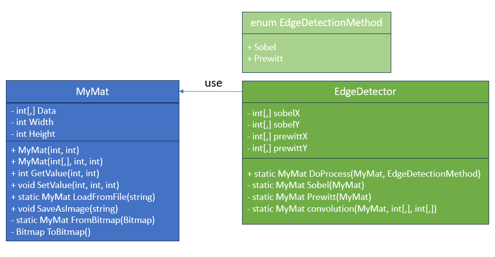

# EdgeDetection

A simple C# image edge detection tool that supports basic **Sobel** and **Prewitt** algorithms.  
The project includes a custom `MyMat` class for handling 8-bit grayscale image input, processing, and output.

## Features

- Load image files (bmp 8-bit) 
- Apply edge detection (Sobel / Prewitt)
- Save processed result images(bmp 8-bit)


## UML Diagram

The following UML diagram illustrates the relationship between the core classes:



## How to Run

1. Make sure you have .NET 9.0 SDK installed
2. Build and run the project:

```bash
dotnet build
dotnet run
```

## Example Usage

```C#
 MyMat mat = MyMat.LoadFromFile("input.bmp");
 MyMat edgeMatrix = EdgeDetector.DoProcess(mat, EdgeDetectionMethod.Sobel);
 edgeMatrix.SaveAsImage("output.bmp");
```

## Result

<div align="center">
  <figure style="display: inline-block; text-align: center; margin: 0 10px;">
    
    <figcaption>Original</figcaption>
  </figure>
  <figure style="display: inline-block; text-align: center; margin: 0 10px;">
    
    <figcaption>Sobel</figcaption>
  </figure>
  <figure style="display: inline-block; text-align: center; margin: 0 10px;">
    
    <figcaption>Prewitt</figcaption>
  </figure>
</div>

## Reference
[https://docs.opencv.org/4.x/d2/d2c/tutorial_sobel_derivatives.html](https://docs.opencv.org/4.x/d2/d2c/tutorial_sobel_derivatives.html)

[https://en.wikipedia.org/wiki/Sobel_operatorl](https://en.wikipedia.org/wiki/Sobel_operator)

[https://en.wikipedia.org/wiki/Prewitt_operator](https://en.wikipedia.org/wiki/Prewitt_operator)


